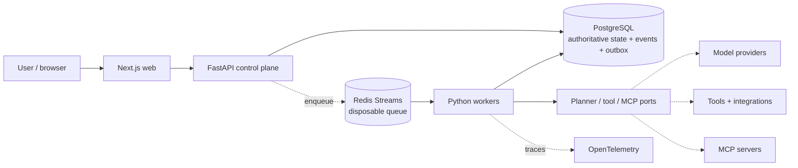

# Forge AI

Forge AI is a durable agent and workflow execution platform: it turns a tenant-scoped objective into a durable run, schedules bounded work, lets AI models propose plans and tool calls, and keeps application code — never the model — authoritative over authorization, budgets, approvals, and execution. It is built as a production-grade system, with every architectural decision, security boundary, and reliability property implemented and tested, not just described.

## What Forge does

- **Durable workflow execution.** Runs are modeled as versioned DAGs of tasks over PostgreSQL, scheduled through a transactional outbox and Redis Streams, executed at least once with idempotency, leases, fencing tokens, retries, dead-lettering, and crash recovery.
- **Typed tools with real authorization.** Tools are versioned, schema-validated, and risk-classified (`read_only` / `simulated_effect`); every call is authorized against run-scoped grants and produces an evidence record with a trust label (`trusted_local_fixture` / `untrusted_tool_output`).
- **Human approval for high-risk effects.** Any action classified as requiring approval is bound to the exact action hash, arguments, tool version, and approver eligibility — approval never grants blanket permission, and a changed argument invalidates a prior approval.
- **Bounded agents.** A perceive-decide-act-observe loop runs under explicit iteration/tool-call/token/cost budgets, with every model decision schema-validated and every citation checked against real persisted evidence before an agent can claim completion.
- **LangGraph and LangChain interoperability.** An equivalent LangGraph-orchestrated execution path exists alongside the custom engine, sharing the same authorization/budget/approval boundary; LangChain is used at provider/prompt/tool-composition seams, never as an authority source.
- **Offline and adversarial evaluation.** A deterministic evaluation harness runs functional, security, and failure-injection cases against both engines and exports local, LangSmith-shaped evidence artifacts.
- **Execution debugger and safe replay.** Every run's event history, model calls, tool invocations, and evidence are correlated and inspectable; simulation replay is safe by default, and replaying real side effects is blocked unless explicitly enabled.
- **MCP interoperability.** Remote MCP servers are discovered into a quarantined state and only reachable after admin review, mediated through the same tool registry, grants, and policy as built-in tools — with SSRF protection, schema-drift detection, and ambiguous-outcome handling.
- **Measured multi-agent patterns.** A deterministic, code-owned router can fan a run out to isolated parallel specialists with a synthesizer aggregating results; a comparative evaluator measures single-agent vs. multi-agent-parallel cost and latency on frozen scenarios rather than adopting multi-agent by default.
- **Hierarchical budgets.** Tenant/workspace daily request, token, and currency ceilings are enforced with atomic reserve-before-work, settle-after semantics — verified safe under real concurrent access.
- **Real observability.** OpenTelemetry traces the async path from API through the outbox to worker execution, with a local, zero-cost span exporter by default and optional, explicitly opt-in export to an OTLP collector (including self-hosted LangSmith/Langfuse-compatible backends).
- **Reviewable cloud deployment design.** A least-privilege AWS topology (VPC, RDS, ElastiCache, ECS Fargate, IAM, Secrets Manager) and hardened container images are authored and validated for correctness, without ever provisioning real cloud infrastructure by default.

## Architecture



PostgreSQL is the only authoritative store; Redis is disposable coordination that can be lost without losing acknowledged work. Provider, tool, MCP, and workflow-engine details stay behind narrow interfaces so deterministic local fakes and real integrations share the same contract. See [`docs/architecture/`](docs/architecture/) for the full system design, ADRs, security threat model, and data/API contracts.

## Local development

The default local path is zero-cost: it uses local PostgreSQL and Redis plus deterministic fakes at every external boundary, and never requires billing credentials, a paid model API, cloud infrastructure, or a purchased domain.

```bash
pnpm install
pnpm demo
```

This starts the local database and queue, applies migrations, seeds a deterministic identity/workflow scenario, and starts the web, API, and worker processes. Open the web app to pick a local identity and exercise real durable workflow execution, agent runs, approvals, and evidence — all through the actual system, not a mock.

Focused command-line demonstrations exercise specific capabilities end-to-end with zero paid calls, for example:

```bash
pnpm demo:agentic         # bounded agent loop, budgets, prompt-injection containment
pnpm demo:approvals       # exact-action human approval boundary
pnpm demo:recovery        # worker crash, stale lease, dead-letter recovery
pnpm demo:mcp             # MCP discovery, quarantine, SSRF/schema-drift handling
pnpm demo:multi-agent     # router, parallel specialists, synthesis, comparison
pnpm capacity-report      # local load/soak throughput and latency measurement
pnpm backup-restore-drill # real pg_dump/pg_restore verification
```

## Quality checks

```bash
pnpm lint
pnpm typecheck
pnpm build
pnpm test
pnpm test:security
```

Live model providers, cloud infrastructure, and any billable integration are excluded from every default command and from CI; they are opt-in, explicitly labeled, and never a prerequisite for development, testing, or demonstration.
