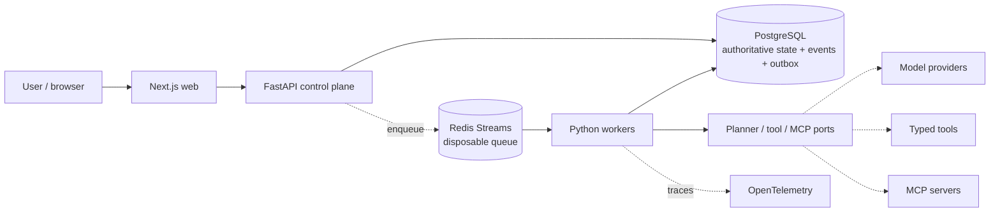
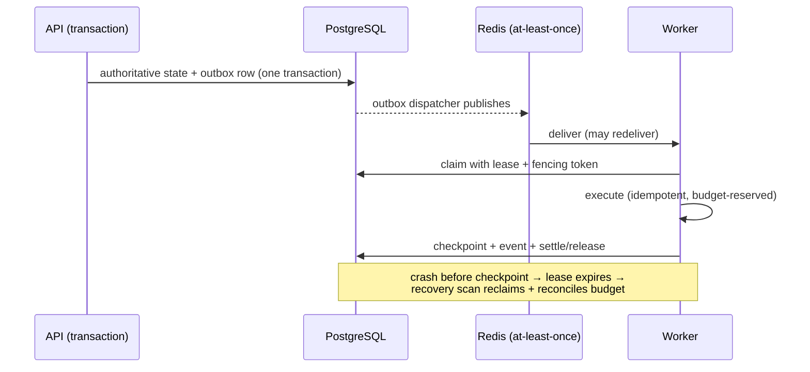
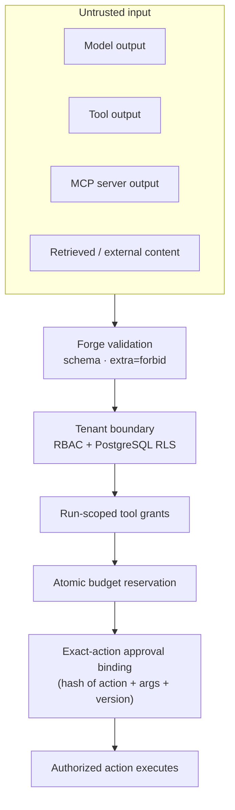

# Forge AI

[](https://github.com/codevoks/forge-ai/actions/workflows/ci.yml)

**A durable, production-oriented AI agent/workflow execution platform where application code — never the model — remains authoritative over authorization, budgets, tools, and high-risk actions.**

Forge turns a tenant-scoped objective into a durable, PostgreSQL-backed run. Models may propose plans, tool calls, and multi-agent coordination — but every proposal passes through Forge's own validation, policy, budget, and approval layer before anything executes. It is built and tested as a real system: durable execution, typed tools, human-in-the-loop approval, bounded agents, MCP interoperability, multi-agent patterns, hierarchical budgets, and distributed tracing are all implemented, adversarially tested, and independently audited — not just described.

```
MODEL PROPOSES  →  FORGE VALIDATES  →  POLICY / AUTHORITY ENFORCES  →  ACTION EXECUTES
```

That one line is the whole design philosophy. Everything below is how it's actually built.

## Demo


*A real local run captured directly from the running application — not a mockup. Identity: Alice Admin. Workflow: `Multi-Agent Investigation Demo`, custom engine (this run did not use LangGraph). Model path: Forge's deterministic, zero-cost fake-model provider — no live model or paid API was called. Three specialists executed in parallel and fed a synthesizer task; the `ticket.create_simulated` tool call was gated behind Forge's exact-action human approval before it could execute, Ava Approver approved it, and the run completed with all four tasks in a terminal `succeeded` state — shown here in the Approval history panel with its action hash, requester, and consumed status.*

<!-- Product demo video/GIF will be inserted here after final UI polish. -->

A recorded walkthrough will live here: an objective becoming a durable run, specialists fanning out and back in, a high-risk action pausing for exact-action human approval and resuming once granted, and a cross-tenant request failing closed — the same run lifecycle, authority boundary, and multi-agent coordination described below, shown end to end. Until then, every one of those scenarios is fully reproducible locally in under two minutes — see [Try it locally](#try-it-locally).

## Why Forge exists

Most "AI agent" projects are a prompt, a tool-calling loop, and a hope that the model behaves. That's fine for a demo; it's not fine for anything a business would run unattended. Forge exists to answer the boring, hard questions that separate a wrapper from a system: What happens when a worker crashes mid-task? Can the same effect run twice? Who is actually allowed to approve a risky action, and can that approval be reused for a slightly different one? What stops a tool's output — or a compromised MCP server's — from becoming an instruction? Forge answers each of these with real, tested mechanisms, not a disclaimer.

## Architecture



PostgreSQL is the **only** authoritative store. Redis is disposable coordination that can be lost without losing acknowledged work. Provider, tool, MCP, and workflow-engine details all stay behind narrow interfaces, so deterministic local fakes and real integrations share one contract — the entire zero-cost demo runs on the exact same code paths as a live deployment would.

<details>
<summary><strong>Durable execution lifecycle</strong></summary>



A worker crash never loses acknowledged state and never leaves phantom resource usage — the recovery scan reclaims stale leases *and* releases any budget reservation the crashed attempt made, verified by a dedicated test that reproduces the exact crash.

</details>

<details>
<summary><strong>Authority model — what "the model proposes, Forge enforces" means in code</strong></summary>



Nothing in the "untrusted input" box can skip a stage. A model response with an unexpected field is rejected by strict schema validation before it reaches application logic; untrusted tool/MCP output is labeled and never promoted to an instruction; every risky action's approval is bound to its exact argument hash, so changing one argument invalidates the approval.

</details>

## Why this isn't an LLM wrapper

| Concern | Forge mechanism |
|---|---|
| Durability | PostgreSQL authoritative state + transactional outbox |
| Duplicate delivery | Idempotency records + action hashes |
| Worker crashes | Leases, fencing tokens, and a recovery scan that also reconciles orphaned budget reservations |
| Runaway agents | Bounded iterations, tool calls, model calls, and token/cost budgets — enforced in code, not by prompt |
| High-risk actions | Exact-action human-in-the-loop approval, bound to the specific action hash and arguments |
| Tool authority | Run-scoped grants — a specialist can never use a tool a sibling was granted |
| MCP trust | Discovery quarantine until admin review, mediated through the same grant/policy/evidence runtime as built-in tools |
| Prompt injection | Trust labels (`trusted_local_fixture` / `untrusted_tool_output`) — untrusted content is recorded, never executed as an instruction |
| Multi-tenancy | RBAC + PostgreSQL row-level security, enforced at the database layer |
| Resource abuse | Atomic hierarchical budgets — reserve-before-work, settle-after, race-safe under real concurrency |
| Debugging | Append-only execution events + a safe-by-default replay mode (real side-effect replay is blocked unless explicitly enabled) |
| Observability | OpenTelemetry trace correlation across the API → outbox → worker async boundary |

## Capabilities

- **Durable workflow execution** — versioned DAGs of tasks over PostgreSQL, scheduled through a transactional outbox and Redis Streams, executed at least once with idempotency, leases, fencing, retries, dead-lettering, and crash recovery.
- **Typed tools with real authorization** — versioned, schema-validated, risk-classified (`read_only` / `simulated_effect`); every call is grant-authorized and produces an evidence record with a trust label.
- **Human approval for high-risk effects** — bound to the exact action hash, arguments, tool version, and approver eligibility.
- **Bounded agents** — a perceive-decide-act-observe loop under explicit iteration/tool/token/cost budgets, with schema-strict model decisions and citation checks against real persisted evidence.
- **LangGraph orchestration** alongside a custom engine, sharing the identical authority boundary; **LangChain** used only at provider/prompt/tool-composition seams.
- **Offline and adversarial evaluation** — a deterministic harness running functional, security, and failure-injection cases, exporting local LangSmith-shaped evidence.
- **Execution debugger and safe replay** — every run's events, model calls, tool invocations, and evidence are correlated and inspectable.
- **MCP interoperability** — remote servers quarantined until admin-enabled, with SSRF protection, schema-drift detection, and ambiguous-outcome handling.
- **Measured multi-agent patterns** — a deterministic router fans a run out to isolated parallel specialists with a synthesizer; a comparative evaluator measures cost/latency against a single agent on frozen scenarios rather than defaulting to multi-agent.
- **Hierarchical budgets** — tenant/workspace daily ceilings, atomic reserve/settle/release, verified safe under real thread contention.
- **Real observability** — OpenTelemetry across the async execution path, local zero-cost export by default, optional OTLP/LangSmith/Langfuse export.

## Security model

Models, tools, MCP servers, and retrieved content are **never** an authority source. Forge application code owns authorization, tenant boundaries, tool grants, approval decisions, budgets, and every state transition. This was independently red-teamed — including chained, cross-subsystem attacks, not just isolated checks:

`cross-tenant denial` · `prompt injection (direct + indirect)` · `malicious MCP metadata/output` · `SSRF + private-address/DNS-rebinding denial` · `approval replay/self-approval/expiry` · `cross-specialist evidence isolation` · `budget reservation races` · `duplicate queue delivery` · `worker-crash recovery` · `secret/trace redaction`

One genuine finding came out of an independent internal audit: a worker crash between reserving and settling budget could leave that reservation's usage counted forever. It was found, fixed, and covered by a regression test — see the [security threat model](docs/architecture/security-threat-model.md) for the full classification.

## Try it locally

```bash
pnpm install
pnpm demo
```

This starts local PostgreSQL and Redis, applies migrations, seeds a deterministic identity/workflow scenario, and starts the web, API, and worker processes. Open `http://localhost:3000`, pick **Alice Admin**, select **Multi-Agent Investigation Demo**, and click **Create selected run** — you'll see specialists fan out and execute in parallel, one pause for exact-action human approval (switch to **Ava Approver** to approve it), and a deterministic synthesizer combine their results, all backed by real durable state you can inspect through the debugger.

### Three scenarios worth seeing

<details>
<summary><strong>Human-controlled risky action</strong> — <code>pnpm demo:approvals</code></summary>

An agent proposes a `simulated_effect` tool call and the run suspends. The approver's own request is correctly rejected (separation of duties), then a real approval consumes it and the run resumes and completes:

```json
{"action": "approval_requested", "result": {"risk": "simulated_effect", "run_status": "running", "worker_outcome": "waiting_approval"}}
{"action": "self_approval_denied", "result": {"code": "approval_self_forbidden", "status_code": 403}}
{"action": "approval_consumed_and_run_completed", "result": {"approved_status": "approved", "terminal_status": "succeeded"}}
{"action": "approval_expiry_failed_closed", "result": {"code": "approval_expired", "run_status": "failed", "status_code": 409}}
```

</details>

<details>
<summary><strong>Durable recovery from a worker crash</strong> — <code>pnpm demo:recovery</code></summary>

Simulates Redis loss and a stale worker lease, then proves the recovery scan reclaims the work and the run still completes correctly:

```json
{"action": "redis_loss_recovery", "result": {"recovery": {"republished_ready_tasks": 2}, "terminal_status": "succeeded"}}
{"action": "stale_lease_fencing", "result": {"stale_commit_accepted": false, "terminal_status_after_recovery": "succeeded"}}
```

</details>

<details>
<summary><strong>Multi-agent investigation with isolated specialists</strong> — <code>pnpm demo:multi-agent</code></summary>

A deterministic router selects only the relevant specialists for an objective, runs them in parallel with isolated evidence, and a synthesizer aggregates the results — with an explicit, measured comparison against a single agent on the same objective:

```json
{"action": "multi_agent_router_selected_specialists", "result": {"selected_roles": ["customer_impact_specialist", "deployment_specialist"], "skipped_roles": ["remediation_specialist"]}}
{"action": "multi_agent_parallel_fanout_and_synthesis", "result": {"distinct_specialist_evidence_tasks": 2, "partial_failure": false, "terminal_status": "succeeded"}}
```

</details>

More focused demos: `pnpm demo:agentic`, `pnpm demo:mcp`, `pnpm capacity-report` (real local throughput/latency), `pnpm backup-restore-drill` (real `pg_dump`/`pg_restore` verification).

## Zero-cost path

The default path never requires billing credentials, a paid model API, cloud infrastructure, or a purchased domain. Every command above runs on local PostgreSQL/Redis and a deterministic fake model provider — deterministic, not a claim of frontier-model intelligence, but a faithful exercise of the real durable engine, security controls, and reliability paths. Live providers, cloud infrastructure, and any billable integration are excluded from every default command and from CI; they are opt-in, explicitly labeled, and never a prerequisite.

## Tech stack

FastAPI · Next.js · PostgreSQL (RLS) · Redis Streams · LangGraph · LangChain · Model Context Protocol · OpenTelemetry · pytest/ruff/mypy (strict) · Terraform (AWS) · Docker · GitHub Actions

## Engineering decisions

Notable, evidence-backed calls — full reasoning in [`docs/architecture/decisions.md`](docs/architecture/decisions.md):

- **Temporal was evaluated and rejected**, not adopted for its own sake. Forge's existing durable engine (outbox, fencing, retries, crash recovery) already provides the guarantees Temporal exists to provide, backed by a real local throughput measurement showing no workflow-history-shaped bottleneck.
- **No multi-agent default.** Multi-agent is opt-in per run, justified by a measured comparison against a single agent on frozen scenarios — coordination overhead is real and shouldn't be assumed away.
- **LangGraph and LangChain sit at specific seams**, never as an authority source — Forge's own state/policy/budget layer is identical whether the custom engine or LangGraph orchestrates a run.

## Deployment status

Precisely, so nothing here is oversold:

| Claim | Status |
|---|---|
| Runs locally, zero-cost, fully functional | ✅ Validated — this is the default path |
| Least-privilege AWS topology (VPC, RDS, ElastiCache, ECS, IAM, Secrets Manager) | Authored and reviewed as Terraform (`infra/terraform/`); `terraform fmt` passes |
| Container images (API/worker/web), non-root, multi-stage | Authored (`apps/*/Dockerfile`); manually reviewed |
| `terraform validate` / `docker build` | Not executed — local disk space was insufficient at write time; documented in [`docs/architecture/deployment-hardening.md`](docs/architecture/deployment-hardening.md) |
| Deployed to AWS / any cloud | ❌ Never provisioned. No live cloud deployment exists |

## Known limitations

- OpenTelemetry trace propagation is bounded to a run's initial parallel fan-out; a task that becomes ready later via the ordinary completion path gets its own fresh (still real) trace rather than continuing the root one. Full causal ordering already exists independently via the append-only event log.
- No live LangSmith/Langfuse export has been exercised (no approved credentials); the local, zero-cost export path is fully implemented and tested.
- `terraform validate` and `docker build` are unvalidated in the current environment (disk space) — see Deployment status above.

## Documentation

- [`docs/architecture/`](docs/architecture/) — system design, ADRs, security threat model, data/API contracts, failure model, scale/observability/cost, zero-cost contract, deployment hardening

## Quality checks

```bash
pnpm lint
pnpm typecheck
pnpm build
pnpm test
pnpm test:security
```
