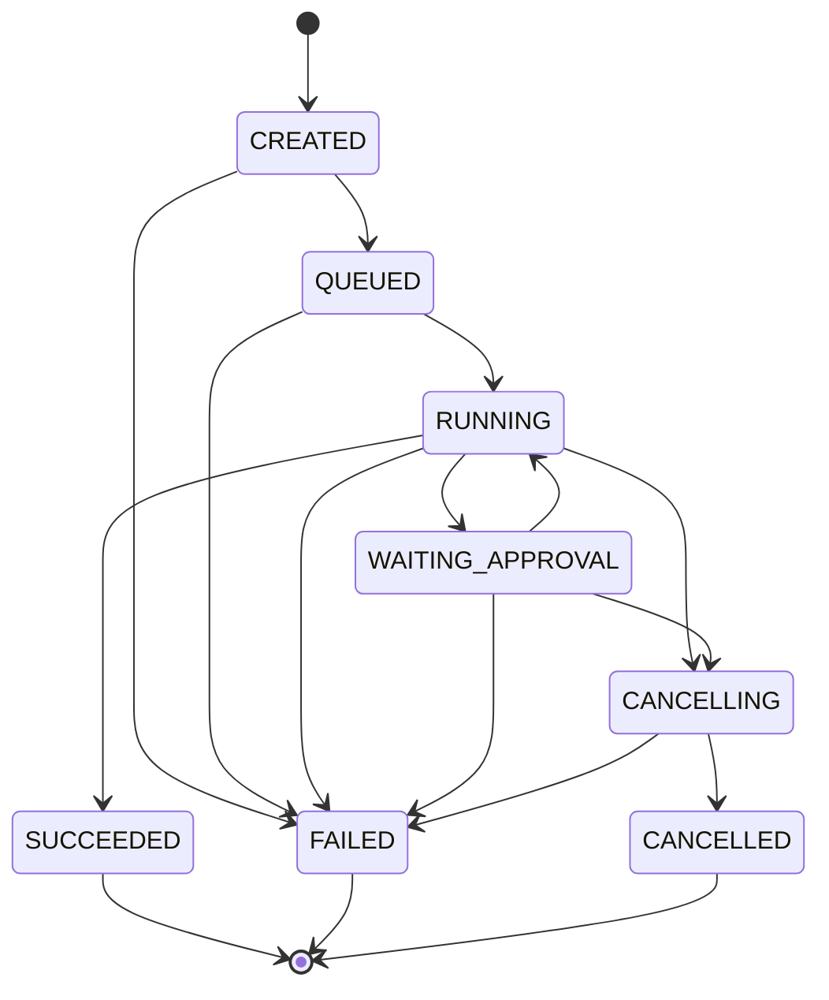
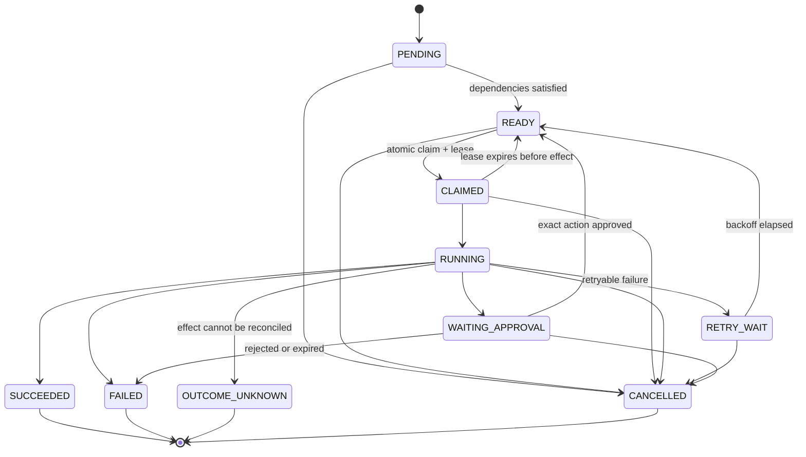

# Domain and workflow model

## Canonical terminology

- **Objective:** user-authored desired outcome plus constraints; immutable after run creation.
- **WorkflowTemplateVersion:** immutable code/user-authored deterministic DAG of step definitions.
- **Run:** one durable execution of an objective under a captured template/policy/tool/budget snapshot.
- **PlanVersion:** immutable validated planner-proposed DAG. Replanning appends a version.
- **Task:** logical run-scoped unit instantiated from a template step or plan node.
- **TaskDependency:** directed prerequisite edge with an explicit satisfaction rule.
- **TaskAttempt:** one leased execution attempt of a task.
- **Checkpoint:** validated resumable state at a safe task/agent-loop boundary.
- **ModelCall:** normalized model request/response/usage/provenance record.
- **ToolInvocation:** exact requested action, policy decision, idempotency identity, and outcome.
- **ApprovalRequest/Decision:** suspend/resume record bound to an immutable action hash.
- **ExecutionEvent:** append-only statement of what changed and why; current tables remain authoritative projections.

“Step” is definition-time vocabulary; “task” is run-time vocabulary; “attempt” is delivery-time vocabulary. Code and UI must not blur them.

## Graph model

User/template/planner work is a finite DAG. Each node has a stable logical key, kind, schema-bound inputs, declared dependencies, execution policy, and optional condition. Edges are adjacency rows, not arrays embedded in a node. Validation requires:

- unique node keys and existing endpoints;
- no self-edge, duplicate edge, or cycle;
- configured node/edge/depth/fan-out bounds;
- reachable terminal path and supported node kinds;
- schema-valid inputs and referenced tool versions;
- policy-compatible tools and budgets;
- no planner authority to add capabilities not present in the run envelope.

Bounded agent loops are state machines inside a task, not graph cycles. This keeps scheduling and termination explainable. Replanning creates a new plan version; completed history is retained and new tasks explicitly supersede/cancel obsolete pending tasks.

## Run state machine

Terminal states are `SUCCEEDED`, `FAILED`, `CANCELLED`. A run succeeds only when its required terminal tasks succeed and no required task is failed, cancelled, or outcome-unknown. Cancellation is a durable request and converges cooperatively; it does not erase history or promise rollback.

## Task state machine

`OUTCOME_UNKNOWN` is terminal for automatic execution and requires reconciliation/operator action. A task becomes `READY` only when all required dependencies satisfy their declared predicates. One active attempt per task is enforced by database constraints/claim transaction.

## Attempt and invocation states

Attempts progress `CLAIMED -> RUNNING -> SUCCEEDED|FAILED|TIMED_OUT|ABANDONED`. A tool invocation progresses `PROPOSED -> POLICY_DENIED|APPROVAL_REQUIRED|AUTHORIZED -> EXECUTING -> SUCCEEDED|FAILED|OUTCOME_UNKNOWN`. Approval consumption and transition to `AUTHORIZED` occur transactionally.

## Non-negotiable invariants

1. Every tenant-owned record includes `tenant_id`; workspace-owned records also include `workspace_id` with matching composite ownership constraints.
2. Immutable snapshots capture workflow, policy version, allowed tools, model configuration, and budgets for a run; tightening emergency policy may still override execution.
3. Every accepted transition increments `version` and creates an event in the same transaction.
4. Terminal state is monotonic except an explicit operator-created retry/recovery resource; history is never mutated back to running.
5. A task is ready only after dependency evaluation under one transactionally consistent view.
6. A queue message is a hint containing durable IDs, never authoritative workflow state or secrets.
7. An approval is one-time, expiring, actor-attributed, and bound to tenant, run, tool version, canonical arguments, risk, and action hash.
8. The approver cannot gain capabilities the run/user did not have; approval satisfies a gate, not authorization.
9. Budget is reserved before work and settled after usage. Exhaustion is a deterministic stop condition.
10. All model/tool inputs and outputs carry provenance and trust labels; untrusted content never becomes policy instruction.
11. Retries create new attempts but reuse the logical operation idempotency key where duplicate effects must collapse.
12. No replay invokes external effects unless a separately authorized replay policy explicitly enables them.

## Context and memory taxonomy

- **Runtime state:** owned by a run, written by runtime transitions, deleted per run retention policy.
- **Conversational context:** constructed per model call from selected run state/evidence; ephemeral or retained with provenance and redaction.
- **Workspace knowledge:** workspace-owned curated artifacts with explicit ingestion, ACL, freshness, deletion, and citation rules.
- **User preferences:** user-owned, opt-in, editable/deletable, never authorization data.
- **Episodic records:** optional derived past-run summaries; off by default until retrieval benefit, lifecycle, and contamination risks are evidenced.

There is no generic “memory” table or ambient write access.

## Termination contract

Every model-controlled loop has maximum iterations, model calls, tool calls, elapsed time, token/currency budget, consecutive invalid decisions, and replans. It stops on success predicate, explicit safe failure, cancellation, approval suspension, budget exhaustion, deadline, policy denial, or repeated no-progress detection.
