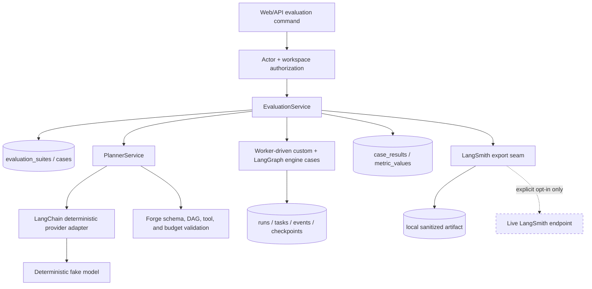
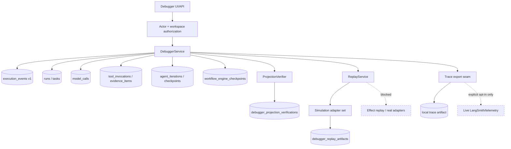

# System architecture

## Derivation

The dominant forces are durable asynchronous work, risky external effects, tenant isolation, explainability, and learning the mechanics before adopting orchestration frameworks. They lead to one deployable system with strict internal boundaries, not premature microservices.

The [visual guide](visual-guide.md) shows this topology, the durable execution sequence, the model-to-effect policy boundary, and the run/task lifecycles. Read the diagrams alongside the invariants below; arrows show communication, not authority.

## Deployable boundaries

- `apps/web`: Next.js UI and same-origin browser facade. It presents state; it never decides authorization or workflow transitions.
- `apps/api`: FastAPI command/query boundary, JWT verification, actor construction, policy calls, and transaction orchestration.
- `apps/worker`: queue consumers, outbox dispatcher, abandoned-work recovery, task execution, and graceful shutdown.
- `packages/config`: validated, non-secret configuration contracts shared where language permits; generated schemas instead of runtime coupling across Python/TypeScript.
- `packages/shared-types`: OpenAPI-derived TypeScript client/types and stable cross-process envelopes. Python domain types remain owned by the backend.

Python backend code begins within the owning app and is extracted only when two deployables truly share a stable concept. Intended internal modules are:

```text
domain/          entities, value objects, state transitions, invariants
application/     use cases and transaction orchestration
policy/          authorization, risk, approval, budget decisions
runtime/         readiness, scheduling, context, bounded execution
planner/         provider-neutral structured planning and validation
tools/           registry and invocation envelope
ports/           repository, queue, model, secret, clock, id factories
infrastructure/  PostgreSQL, Redis, providers, MCP, telemetry adapters
api/             HTTP schemas/routes/dependencies
```

Dependencies point inward: infrastructure and delivery depend on application/domain contracts; domain imports no web, database, queue, model, or provider SDK.

## Command path

1. API verifies issuer/audience/signature/expiry, constructs `ActorContext`, and resolves tenant/workspace membership.
2. Request schema and idempotency key are validated before application use case execution.
3. Within one PostgreSQL transaction the use case locks/checks relevant versions, applies domain transitions, writes current state plus execution events, and appends outbox messages.
4. The API returns the committed resource. It does not directly enqueue work.
5. A dispatcher publishes outbox records and marks them published. Crash windows can duplicate publication by design.

## Worker path

1. Consumer receives a tenant-tagged job and checks its durable identity/deduplication record.
2. It atomically claims the task/attempt using status, lease, and version predicates.
3. It re-evaluates cancellation, policy, approval, and budgets against current authoritative state.
4. It performs one bounded unit, recording invocation intent before any external effect.
5. It validates/sanitizes output, persists outcome/event/outbox atomically, then acknowledges the queue message.
6. On timeout/crash, lease recovery makes the unit eligible again. Idempotency controls determine whether an effect may be retried, reconciled, or must remain `outcome_unknown`.

## Planning path

1. API verifies the actor and requires an idempotency key for `POST /v1/runs/{run_id}:plan`.
2. `PlannerService` authorizes the actor against the run workspace using the same capability model as run creation.
3. The context builder loads a versioned planner prompt, active tool projection, objective, workflow name, and bounded evidence summaries. It does not include secrets, raw provider payloads, or policy internals.
4. A `ModelProvider` implementation returns a structured result. The default deterministic fake provider supports success, malformed-output repair, hallucinated-tool rejection, cyclic-plan rejection, refusal, and prompt-injection scenarios with no network call.
5. The parser enforces the structured schema. `PlanValidator` then enforces DAG bounds, acyclicity, and exact active tool name/version membership.
6. Forge persists a `model_call` for every attempt and a `plan_version` with validated or rejected status. Validated plans store nodes and edges; rejected plans store safe validation errors. Existing validated plans are superseded rather than rewritten.
7. The planner does not execute tools, mutate tasks, expand authority, or bypass approvals. Bounded agentic execution is implemented separately inside the deterministic worker envelope.

## Bounded agent execution path

1. A published workflow may contain an `agent` task. The run creation transaction snapshots only the exact tool versions declared in that agent task's `allowed_tools`; later model decisions cannot expand the grant set.
2. The worker claims the agent task with the same lease, fencing, inbox, and outbox mechanics as deterministic/tool tasks.
3. `AgentRuntime` builds a bounded state from the task objective, allowed tools, counters, budgets, and compacted persisted evidence. Tool output remains untrusted data.
4. The deterministic fake agent model returns one structured decision per iteration: `tool_call`, `complete`, `fail`, or `request_replan`.
5. Application code validates the decision schema, run-scoped tool grants, strict tool input schema, budgets, no-progress counters, and completion citations before any action happens.
6. Every iteration records a model-call ledger entry, an `agent_iterations` row, an execution event, and an `agent_iteration` checkpoint. A validated tool decision then invokes the existing tool runtime, including approval gates where applicable.
7. The loop terminates on cited completion or fails closed on invalid repeated decisions, budget exhaustion, unsupported citations, ungranted tools, unavailable replan, cancellation, or worker lease/recovery boundaries.

The default path remains zero-cost: `forge-fake-agent-v1` is deterministic, live providers are disabled, and all tool calls use local registered adapters.

## LangGraph comparison execution path

Phase 8 adds LangGraph as a selectable `WorkflowEngine` strategy for the same bounded agent task. The custom engine remains the default. A run may select `engine_kind=langgraph`; the worker then executes the agent task through a local open-source LangGraph `StateGraph` composed of explicit nodes:

```text
load_state -> decide -> validate_and_record -> tool_node -> load_state
                                      |-> complete_node
                                      |-> fail_node
```

LangGraph owns framework-level node routing for the comparison only. Forge remains authoritative for tenant scope, task claims, tool grants, strict schemas, approvals, evidence, budgets, checkpoints, task/run transitions, and audit events. The LangGraph state carries only minimal resumable references and bounded state summaries. It never becomes a second tenant/security database and cannot directly invoke provider tools.

The `ForgeLangGraphCheckpointer` mirrors sanitized framework checkpoint metadata into PostgreSQL under `workflow_engine_checkpoints`, mapped to Forge run/task/attempt identifiers. These records are inspectable comparison evidence; they are not an authority source for authorization, scheduling, approval, or external effects. Approval interrupts are represented at the LangGraph tool boundary, but the actual suspension/resume path is still the Phase 6 exact-action approval mechanism.

## Evaluation and framework-boundary path

The offline evaluation harness is a control-plane use case, not a production request-path dependency. It invokes public application services under an authorized actor, records deterministic case verdicts, and keeps framework integrations behind the same non-authoritative seams used by production code.



LangChain and LangGraph can structure prompts, message flow, and graph execution, but they cannot grant tools, approve effects, change tenant scope, suppress budgets, or mark a run successful. LangSmith export is observational: default mode writes a local sanitized artifact with `live_export=false`; live export requires explicit external-integration opt-in and cannot affect evaluation verdicts.

## Execution debugger and safe replay path

The debugger is an operator/read-model use case over already-committed evidence. It does not resume framework checkpoints, consume approvals, enqueue work, or write authoritative run/task state. Cursor feeds are scope-revalidated on every request; SSE remains deferred because polling plus cursor resume satisfies the current product demo without adding a reconnect lifecycle.



Projection verification folds known event schemas and compares the result with current authoritative rows; mismatches are persisted as debugger findings and never auto-repaired. Simulation replay records event hashes, model-call references, and tool action hashes with tripwires proving that real effect adapters and previous approvals were not used. LangGraph checkpoints are displayed beside Forge events for reconstruction only; they cannot become authorization or scheduling inputs.

## Control plane versus execution plane

- **Control plane:** identity, tenant/workspace administration, workflow/tool registration, policies, credentials references, budgets, approvals.
- **Execution plane:** runs, tasks, attempts, planning/model calls, tool invocations, events, scheduling, recovery.

They share the initial database and services but have separate modules, permissions, quotas, and audit categories. This creates an extraction seam without paying microservice consistency costs early.

## Consistency choices

- Strong transactional consistency for state transitions, dependency readiness, claims, approval consumption, budget reservations, tool-intent records, and outbox creation.
- Eventual consistency for queue publication, UI projections/search, metrics, trace export, and Langfuse export.
- No distributed transaction with model/tool providers. Use intent records, idempotency keys, bounded retry, status reconciliation, and compensating actions where meaningful.
- Read-your-writes comes from the primary database initially. Replica reads, if added, must expose staleness and never drive security or scheduling decisions.

## Extension seams

- `QueuePort`: in-process deterministic fake then Redis Streams; Temporal adapter only after evidence.
- `ModelProvider`: deterministic fake, OpenAI/Bedrock adapters, LangChain-backed interoperability/composition adapter, normalized usage/errors.
- `Tool`: local deterministic implementations and MCP proxy share one validated invocation contract.
- `WorkflowEngine`: custom explicit runtime and LangGraph implementation share domain repositories, policy, tools, approvals, checkpoints, and events.
- `TelemetryPort`/evaluation export: local reports and OpenTelemetry-compatible sinks by default; LangSmith/Langfuse adapters are opt-in, redacted, and non-authoritative.
- `PolicyEngine`: code-owned interfaces; start with explicit Python policies, benchmark a policy DSL/OPA only if complexity demands it.

## Why not microservices now

The transaction boundary across runs, tasks, approvals, budgets, and outbox is valuable. A modular monolith preserves it, makes failure reasoning visible, lowers operational load, and still permits API and workers to scale separately. Extraction requires measured contention, team ownership, or security isolation—not fashion.
