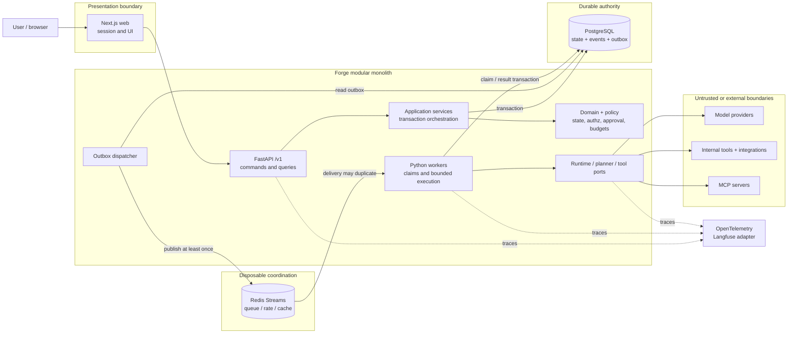
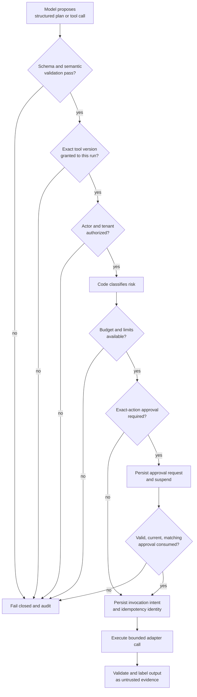
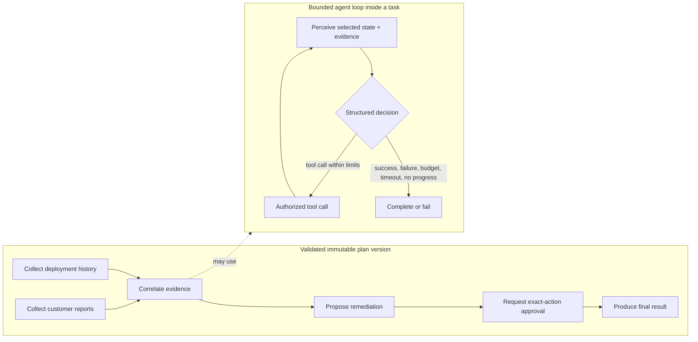

# Forge AI visual guide

These diagrams are learning aids for the written contracts. They deliberately show where authority, durability, and security decisions live; they are not deployment claims.

## System topology and authority

PostgreSQL is the only authoritative execution store. Redis carries disposable scheduling hints. The API and workers share domain/application contracts while external systems remain behind ports.



## Durable command and worker sequence

The two critical rules are visible here: commit state and outbox together, and acknowledge the queue only after the result transaction. Duplicate publication/delivery is expected.

```mermaid
sequenceDiagram
    autonumber
    actor User
    participant API as FastAPI
    participant PG as PostgreSQL
    participant D as Outbox dispatcher
    participant Q as Redis Streams
    participant W as Worker
    participant X as Model / tool provider

    User->>API: Create run + Idempotency-Key
    API->>PG: Begin transaction
    API->>PG: Write run, tasks, event, outbox
    API->>PG: Commit
    API-->>User: Accepted run
    D->>PG: Read unpublished outbox
    D->>Q: Publish durable IDs
    Note over D,Q: Crash here may publish twice
    D->>PG: Mark outbox published
    Q-->>W: Deliver message
    W->>PG: Atomically claim task + lease/fencing
    W->>PG: Persist authorized invocation intent
    W->>X: Bounded request with stable idempotency key
    X-->>W: Result or ambiguous timeout
    W->>PG: Commit result, event, checkpoint, next outbox
    W->>Q: Acknowledge message
    Note over W,Q: Crash before ack causes redelivery; durable state deduplicates
```

## Model proposal to authorized effect

The model never crosses directly into execution. Each deterministic gate can deny, suspend, or bound the proposal.



## Workflow shape and bounded autonomy

Forge keeps the user/planner work graph acyclic. Model-controlled iteration lives inside one task and is bounded independently, so dependency scheduling and termination remain explainable.



## Lifecycle visuals

The canonical run and task state diagrams live beside their invariants in the [domain and workflow model](domain-workflow-model.md). The [failure model](failure-model.md) explains what happens at every crash, retry, cancellation, and ambiguous-effect edge.

