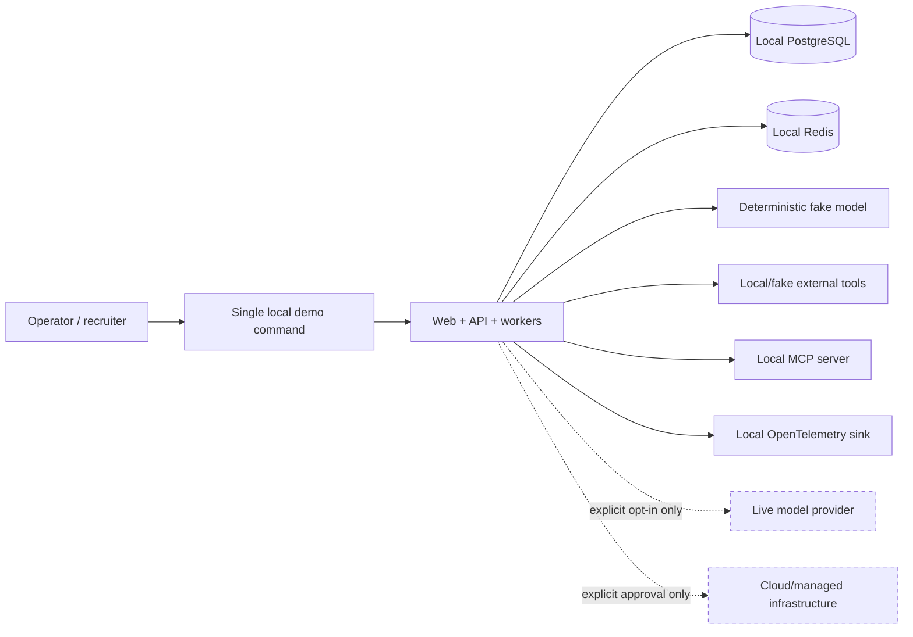

# Zero-cost development and portfolio demonstration

## Binding objective

Forge must be buildable, testable, evaluated, and demonstrated locally for INR 0. The mandatory path requires no paid SaaS subscription, cloud account, billing credential, purchased domain, temporary trial credit, or large local model download. This is a permanent architecture profile, not a temporary bootstrap shortcut.

The zero-cost profile must demonstrate the real system properties that make Forge valuable: PostgreSQL-authoritative state, transactional outbox delivery, queues and workers, at-least-once handling, idempotency, leases and fencing, retries, checkpointing, recovery, cancellation, bounded state machines and DAGs, exact-action approval, policy enforcement, safe tool execution, event history, replay, tenant isolation, MCP mediation, and multi-agent coordination. Deterministic fakes replace only unavoidable external boundaries such as paid model providers and third-party services.

## Profile boundary

The production-capable and demo paths share domain ports and contract tests. They do not share permissive defaults. A production adapter cannot become active merely because a credential is present in the environment.

## Mandatory safety defaults

- The default configuration selects deterministic fake model, tool, notification, and remote-service adapters.
- Default tests, CI, offline evaluations, and the demo command make no live provider calls. They should deny unexpected network access where practical.
- Any adapter capable of spending money or provisioning resources requires an explicit profile/flag in addition to credentials. Its tests are separately labeled and excluded from default commands.
- Live model runs require an explicit opt-in, a finite request/token/currency budget, and clear output labeling. Trial credits are treated as billable capability, not as the permanent free path.
- Cloud `apply`, deployment, or resource mutation is never part of `pnpm demo`, CI, or a phase gate. It requires explicit user approval in the current task.
- Secrets and billing credentials are never seeded, inferred, or requested for the zero-cost path.
- A phase report states which profile ran, which external adapters were disabled, and what evidence supports the claim that no billable call occurred.

## Implementation contract for cost safety

Cost safety is enforced at the composition root, not by convention inside individual adapters. Introduce a typed `ExternalIntegrationMode` with `disabled` as the default for development, tests, CI, offline evaluations, and demos. Every adapter descriptor declares whether it is `local_zero_cost` or `potentially_billable`. Composition fails before startup if a potentially billable adapter is selected while external integrations are disabled; discovering a credential must never change that decision.

The top-level demo command forces external integrations disabled and the fake model selected, and rejects contradictory configuration. Default test runners exclude a separately named `live` marker/project and install a network tripwire that permits only loopback and explicitly started local containers. Live evaluation later receives its own non-default command, explicit enable flag, named provider, and hard request/token/currency limits. Business `BudgetService` remains necessary even when the cost-safety guard is active; the former controls tenant/run consumption, while the latter prevents accidental external spending by developers.

Infrastructure tooling follows the same split: local `format`, `validate`, policy scan, and non-applying plan commands are safe defaults; `apply`, deploy, managed-service mutation, and remote-state bootstrap are separate commands that are never called transitively by demo, test, build, or CI workflows.

## Reproducible demo contract

The repository will evolve one top-level `pnpm demo` entry point. Phase 1 owns the command skeleton and local health/identity demonstration. The current demo starts local PostgreSQL and Redis, runs migrations and seed data, starts the API, starts the worker process, and starts the web UI. It exposes local run creation, queued worker execution, worker-state inspection, cancellation, recovery scan, and dead-letter recovery through the web/API. Later phases extend the same command without activating live integrations. The command must be safe to repeat and must never activate live integrations.

Docker is preferred where it gives a reproducible local service boundary, but the demo documentation must expose resource requirements and direct component commands for debugging. Optional heavyweight services and local models belong in opt-in profiles. PostgreSQL and Redis remain the core local infrastructure; additional self-hosted components are introduced only in their owning phases.

## Phase-by-phase paid-risk review

| Phase | Potentially paid or externally controlled dependency | Mandatory zero-cost development/demo equivalent | Production-capable path retained |
|---|---|---|---|
| 01 | Hosted OIDC tenant, hosted frontend/API, managed PostgreSQL, billable CI minutes | Local OIDC test issuer, local web/API/worker, PostgreSQL in Docker; seeded identities/RBAC and identical local quality commands | Standard OIDC/JWKS adapter, deployable processes, and optional CI workflow |
| 02 | Managed database | Local PostgreSQL with real transactions, constraints, RLS, state machines, and DAG tests | PostgreSQL contracts remain deployment-portable |
| 03 | Managed Redis/queue/workers | Local Redis and workers plus deterministic queue fake for unit/fault tests | `QueuePort` supports a later managed-compatible adapter |
| 04 | Paid third-party tools/APIs, hosted secret manager | Local deterministic tools and fake external-effect provider; real policy, intent ledger, idempotency, and reconciliation | Tool and secret ports preserve real integration seams |
| 05 | Paid LLM APIs, Bedrock, large local model download | Scriptable deterministic fake model that covers valid, invalid, refusal, timeout, and malformed planning | Optional live provider adapters behind explicit opt-in |
| 06 | External approval/notification systems, cloud secret/egress products | Local approval UI/API, local attack corpus, fake notification and secret-reference adapters | Notification, secret, and egress ports remain replaceable |
| 07 | Token-consuming agent execution and paid tools | Full real agentic runtime driven by scripted fake model and local tools | Same model/tool ports support opt-in live integrations |
| 08 | Hosted LangGraph services or paid model calls | Open-source LangGraph library locally with fake model and Forge-owned persistence/policy | Engine port permits evaluated production topology |
| 09 | Live-model evaluation, paid judge model, hosted evaluation platform | Versioned local datasets, deterministic scenarios, exact/schema/rule graders, local reports | Live/model-graded lanes remain optional and separately labeled |
| 10 | Paid tracing/replay/analytics backend | Local event history plus OpenTelemetry collector and a free local Jaeger-compatible viewer/sink where needed | Vendor telemetry adapter stays optional and non-authoritative |
| 11 | Paid/remote MCP servers and APIs | Forge-owned local MCP server and deterministic local tools | Authenticated remote MCP adapter remains policy-gated and opt-in |
| 12 | Multi-agent token cost and hosted coordination | Deterministic fake-model specialists/router/synthesizer over the real DAG/runtime/budget system | Optional live comparison uses the same frozen scenarios and explicit budget |
| 13 | Temporal Cloud, Langfuse Cloud, AWS/Bedrock, managed DB/Redis, paid observability, domain, remote Terraform backend | Local/self-hosted Temporal spike or documented no-adoption comparison; local OTel viewer and optional self-hosted Langfuse; local load/failure drills; Terraform format/validate/plan without apply | Cloud topology, adapters, IaC, and runbooks remain reviewable but provisioning requires explicit approval |

## Evidence and claims

The fake/local profile proves Forge-owned correctness and failure behavior; it does not prove a vendor's quota behavior, managed-service availability, cloud IAM configuration, live-model quality, or real provider latency/cost. Those claims require separately authorized, measured evidence and must name the profile and dependency used.

Contract tests should run against both fake/local adapters and any optional live adapter when explicitly enabled. This limits abstraction drift while preserving a zero-cost default. Evidence-gated decisions may reject a framework or managed service; production-grade design does not require adopting every integration.

## Tradeoffs

- Deterministic model scripts provide repeatable failure and security coverage but cannot estimate live-model quality or provider drift. Optional live evaluations answer that separate question.
- Local PostgreSQL/Redis/telemetry demonstrate architecture and operations on one machine but not managed failover, regional latency, or cloud control-plane behavior.
- Self-hosted optional services avoid subscription cost but add local resource and operational burden. They are included only when the learning or architecture comparison justifies that burden.
- Terraform validation and review demonstrate IaC structure without proving a real deployment. Deployment claims remain explicitly deferred until approved evidence exists.
- A single local demo command improves recruiter usability, but individual commands and state inspection remain documented so the owner can debug and defend the system rather than treating the demo as a black box.
